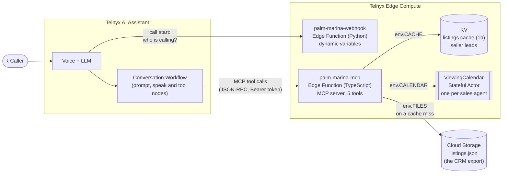
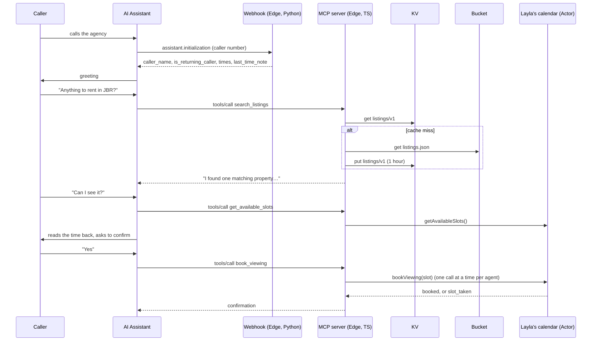
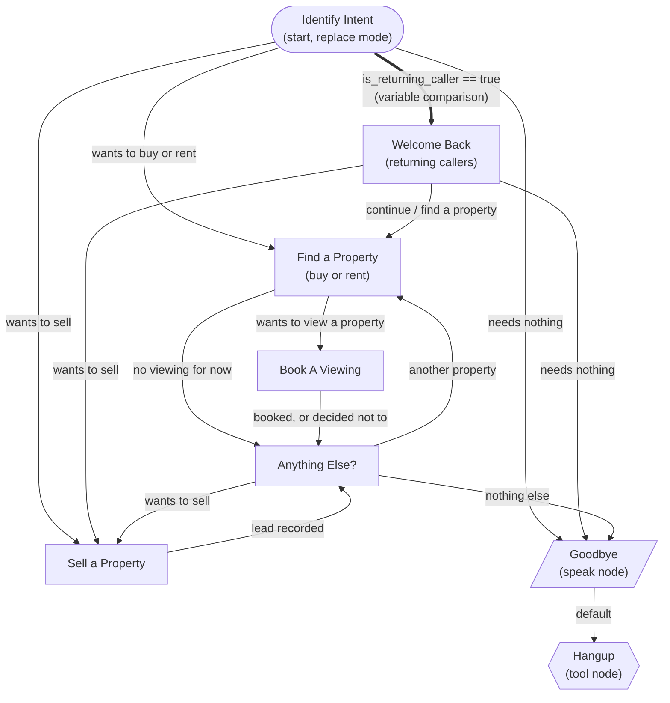

# Palm & Marina Realty: AI Phone Concierge

A voice assistant for a (fictional) Dubai real estate brokerage, built on Telnyx AI Assistants and Telnyx Edge
Compute. It answers calls 24/7, recognises returning callers, searches listings, books property viewings with the
right sales agent without ever double-booking, and records seller leads.

Business context and stages: [PLAN.md](PLAN.md). How it was built, and what broke along the way:
[thought_process_and_issues.md](thought_process_and_issues.md).

## Try it

| What | Where |
| --- | --- |
| Phone number | _to be added_ |
| MCP server (Edge Function, TypeScript) | `https://palm-marina-mcp-f24fbfd6-1.telnyxcompute.com/mcp` |
| Dynamic variables webhook (Edge Function, Python) | `https://palm-marina-webhook-d6c32598-4.telnyxcompute.com/` |
| Health checks | `GET /health` on either URL |

Things to say on a call:

- "Do you have anything to rent in JBR?" → searches the listings.
- "Can I see it?" → offers free viewing times, reads the booking back, books it after you say yes.
- "I want to sell my 2-bedroom in JLT for 1.5 million." → records a seller lead.

## Architecture



| Piece | What it does |
| --- | --- |
| **AI Assistant + Workflow** | Greets the caller, works out what they want, and routes to the right step. |
| **Webhook** (`palm-marina-webhook`) | Called once at the start of every call. Looks up the caller's number and returns dynamic variables: name, returning or not, country, local and Dubai time, and what they wanted last time. |
| **MCP server** (`palm-marina-mcp`) | The tools the assistant calls during the conversation. One TypeScript function: the actor, KV and the bucket are all bindings on `env`. |
| **Cloud Storage** | `listings.json` in a bucket stands in for the brokerage's CRM export. It is the source of truth for listings. |
| **KV** | A one-hour cache of the listings, so most searches never read the bucket, plus one key per seller lead. |
| **Stateful Actor** | One `ViewingCalendar` per sales agent. Bookings for an agent go through their actor one at a time, so a slot can never be booked twice. |

### What happens during a call



## Conversation workflow



- **Returning callers are routed deterministically.** The webhook returns `is_returning_caller`, and a
  variable-comparison edge (thick arrow) sends them to **Welcome Back**, which greets them by name and offers to
  continue their last search. It is checked before the model's turn, so it doesn't depend on the LLM.
- **Every other edge is an LLM condition.** On calls the model moves on by calling a transition tool, so each node's
  instructions say explicitly when to "call the transition tool".
- **One node per job.** Find a Property covers buying and renting (it's the same search with a different `purpose`);
  only Book A Viewing books, so the read-back always happens before a booking.
- **Identify Intent runs once per call.** Anything Else routes straight to the working nodes instead of looping back,
  so the returning-caller check can't fire twice.
- **Goodbye is a speak node** so the closing line is delivered word for word, and the **Hangup tool node** ends the
  call deterministically.

## MCP tools

| Tool | What it does | Backed by |
| --- | --- | --- |
| `search_listings` | Filter by buy or rent, area, bedrooms and budget; describes up to 3 matches for the phone | KV cache → bucket |
| `get_available_slots` | Next free viewing times with the listing's agent (10:00, 12:00, 14:00, 16:00 Dubai time, next 7 days) | the agent's actor |
| `book_viewing` | Books an exact slot id; returns `slot_taken` with alternatives if someone was faster | the agent's actor |
| `cancel_viewing` | Cancels by booking id | the agent's actor |
| `record_seller_lead` | Saves a seller's area, type, bedrooms and asking price | KV, one key per lead |

The area is an `enum` built from the listings data, so the model maps "JBR" to "Jumeirah Beach Residence" itself,
and a new area in `listings.json` becomes searchable without code changes.

## Dynamic variables

Returned by the webhook at the start of every call and used in the assistant's instructions:

| Variable | Example | Used for |
| --- | --- | --- |
| `caller_name` | `James` | greeting returning callers by name |
| `is_returning_caller` | `"true"` | whether to greet as returning |
| `last_time_note` | `2-bedroom in Dubai Marina to buy, up to AED 2.5M` | picking up where they left off |
| `caller_country` | `United Kingdom` | local awareness |
| `caller_local_time`, `dubai_time` | `11:50 AM`, `2:50 PM` | "4pm Dubai time, 1pm for you in London" |

Any failure returns safe "new caller" defaults within the 1.5 second timeout, so the call always goes ahead.

## Why each Edge primitive

| State | Primitive | Why |
| --- | --- | --- |
| Viewing bookings | **Stateful Actor**, one per sales agent | Booking is a read-modify-write ("is 4pm free? then take it"). Two callers at the same moment would both see "free" in a normal function. An actor runs one call at a time, so the second sees the slot is taken. One actor per agent means agents never wait on each other. |
| Listings | **Cloud Storage** + **KV cache** | Listings belong to the brokerage's CRM, not the voice agent. The bucket stands in for that export; KV keeps a one-hour copy for fast reads. KV is never the only copy. |
| Seller leads | **KV**, one key per lead | Written once and never updated, so each lead has its own key and two leads can't overwrite each other. |
| Caller lookup | **Plain function** (webhook) | Stateless lookup per call, no shared state needed. |

## Observability

**What is logged.** Every request writes one JSON line:

- MCP server: `rpc_method`, `tool`, allowlisted arguments (never names or phone numbers), `outcome`, `count`,
  `cache` (`hit` / `miss`), and on failure `error` or `auth_failure` with the reason.
- Webhook: masked caller number (`+44****56`), channel, returning or not, `outcome`.

Status and latency per request come from the platform's invocation logs, so they are not duplicated in our lines.

```bash
telnyx-edge logs palm-marina-mcp --tail | grep -v metrics-snapshot   # our JSON lines, live
telnyx-edge logs palm-marina-mcp --type invocations                   # every request: status + duration
telnyx-edge metrics palm-marina-mcp                                   # request, error and latency summary
telnyx-edge actors logs ViewingCalendar --type invocations            # every actor method call
```

**How I'd know within a minute that it's broken, and what I'd look at first:**

1. **Is traffic arriving?** `telnyx-edge logs palm-marina-mcp --type invocations`. No requests during a call means
   the assistant isn't reaching the function: check the MCP server URL in the portal.
2. **Is it failing?** In the same output, 401 or 5xx statuses. `telnyx-edge metrics` shows the error counts.
3. **Why?** Our JSON line for that request says it directly: `auth_failure` (missing header, wrong token, secret
   not set), `listings_unavailable` with the storage error, or `exception`.
4. **Webhook side:** `telnyx-edge logs palm-marina-webhook`. `outcome: exception` or `bad_body` means callers are
   being treated as new callers.

Today this is checked by hand. The next step would be `telnyx-edge log-export` to an OTLP collector (for example
Grafana) with an alert on 5xx or `auth_failure` lines.

**Evidence from development.** Every bug below was found from a log line, not by guessing (details in
[thought_process_and_issues.md](thought_process_and_issues.md)):

| Symptom in the portal | What the logs said | Cause |
| --- | --- | --- |
| "Error listing tools" | `POST /` → 404 | the reference example wasn't real MCP (REST, no JSON-RPC) |
| "Error listing tools" | `auth_failure: no authorization header` | the assistant used a duplicate MCP server entry without the API key |
| "Error listing tools" | `auth_failure: MCP_TOKEN secret not set` | secrets are environment variables, not `env` properties |
| "500 Internal Server Error" | `NoSuchBucket` | bucket created in `us-central-1`, code looked in `eu-central-1` |

Joining the invocation durations with our log lines by timestamp also showed every listings read costs about 1 s
through KV (about 3 s on a cache miss). That is why an in-memory layer in front of KV is the next improvement.

## Repository layout

```
palm-marina-mcp/         MCP server (TypeScript Edge Function, actor, KV and bucket bindings)
palm-marina-webhook/     Dynamic variables webhook (Python Edge Function)
docs/                    Screenshots and saved log evidence
PLAN.md                  Product and build stages
CHALLENGE.md             The challenge brief
AGENTS.md                Rules for the coding agents
.opencode/               OpenCode config with the @telnyx/opencode plugin
```

## Running and deploying

```bash
# MCP server
cd palm-marina-mcp
npm install
npm test                 # vitest, fakes for KV, the bucket and the actor
telnyx-edge ship

# Webhook
cd palm-marina-webhook
python3 -m pytest
telnyx-edge ship
```

One-time setup:

- `telnyx-edge secrets add MCP_TOKEN <token>`, and the same token as an integration secret in the portal, selected
  as the MCP server's API Key.
- A KV namespace (`telnyx-edge storage kv create`) and a Cloud Storage bucket with `listings.json` uploaded, both
  referenced in `palm-marina-mcp/telnyx.toml`.

Admin routes on the MCP server, protected by the same token:

```bash
curl -H "Authorization: Bearer $TOKEN" https://palm-marina-mcp-f24fbfd6-1.telnyxcompute.com/admin/viewings     # bookings per agent
curl -H "Authorization: Bearer $TOKEN" https://palm-marina-mcp-f24fbfd6-1.telnyxcompute.com/admin/leads        # seller leads
curl -X POST -H "Authorization: Bearer $TOKEN" https://palm-marina-mcp-f24fbfd6-1.telnyxcompute.com/admin/cache/clear  # reload listings now
```

## Built with Telnyx Inference

Developed with OpenCode and the `@telnyx/opencode` plugin (see `.opencode/opencode.json`), using Telnyx-hosted
models (Kimi K2.6, then GLM 5.2). Notes on the setup and on working with the agents are in
[thought_process_and_issues.md](thought_process_and_issues.md).
