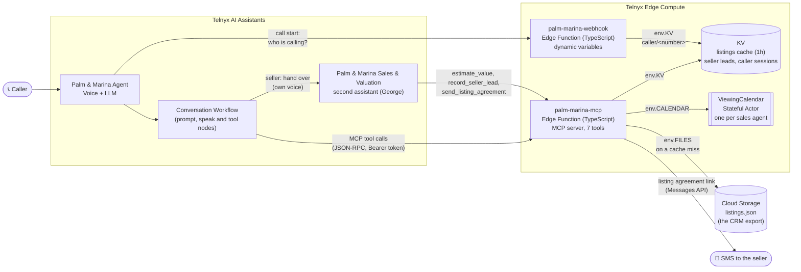
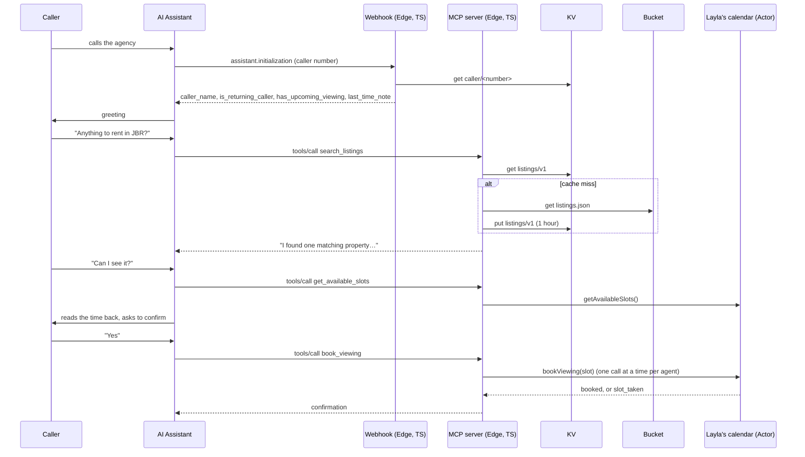
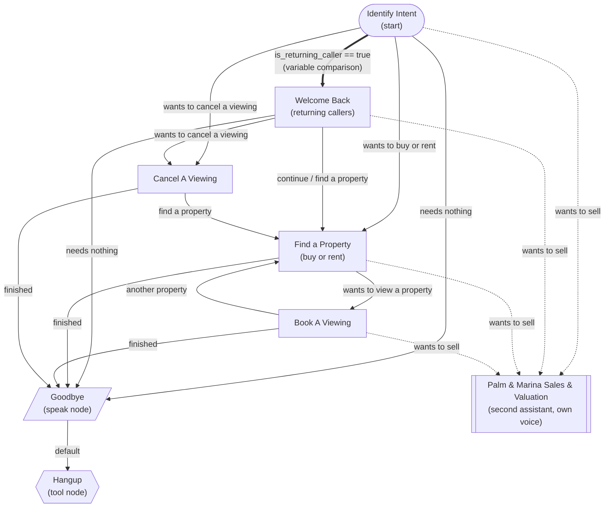
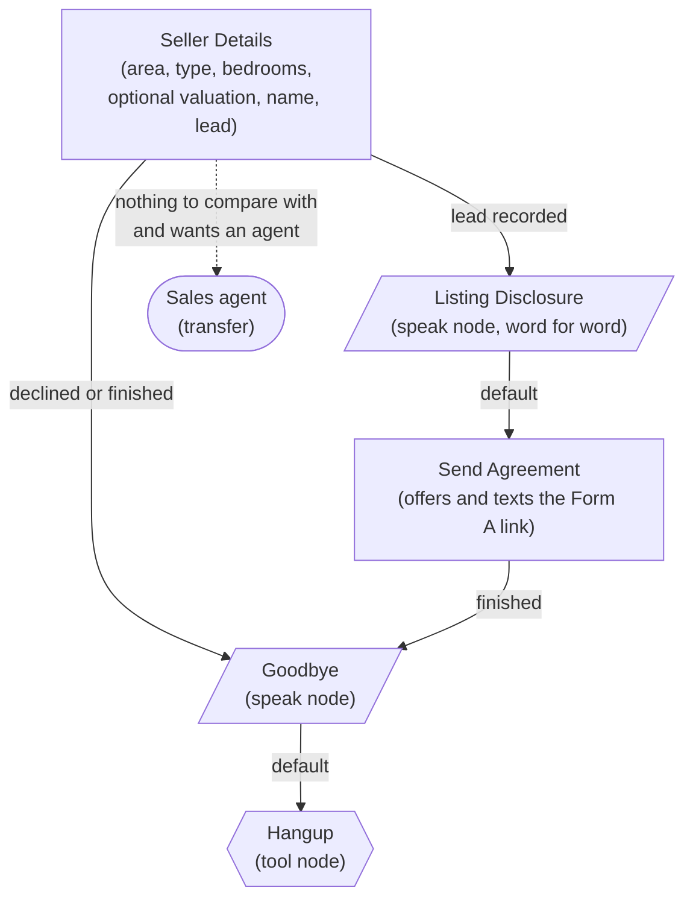

# Palm & Marina Realty: AI Phone Concierge

A voice assistant for a (fictional) Dubai real estate brokerage, built on Telnyx AI Assistants and Telnyx Edge
Compute. It answers calls 24/7, recognises returning callers, searches listings, books property viewings with the
right sales agent without ever double-booking, and hands sellers to a second assistant, a listings specialist,
who takes the property details, offers a rough valuation and texts them the listing agreement (Form A) to sign.

Business context and stages: [PLAN.md](PLAN.md). How it was built, and what broke along the way:
[thought_process_and_issues.md](thought_process_and_issues.md).

## Try it

| What | Where |
| --- | --- |
| Phone number | **+1 (907) 416-6709** |
| MCP server (Edge Function, TypeScript) | `https://palm-marina-mcp-f24fbfd6-1.telnyxcompute.com/mcp` |
| Dynamic variables webhook (Edge Function, TypeScript) | `https://palm-marina-webhook-d362b322-9.telnyxcompute.com/` |
| Health checks | `GET /health` on either URL |

Things to say on a call:

- "Do you have anything to rent in JBR?" → searches the listings.
- "Can I see it?" → offers free viewing times, reads the booking back, books it after you say yes.
- "I want to sell my 2-bedroom apartment in Dubai Marina." → hands you to George, the listings specialist (a
  different voice), who offers a rough valuation, reads a short legal disclosure and texts you the listing agreement.

## Architecture



| Piece | What it does |
| --- | --- |
| **AI Assistant + Workflow** | Greets the caller, works out what they want, and routes to the right step. |
| **Listings assistant** | A second assistant with its own voice, tools and workflow. Sellers are handed over to it; it records the property, offers a rough valuation and texts the listing agreement. |
| **Webhook** (`palm-marina-webhook`) | Called once at the start of every call. Reads the caller's session summary from KV in one call and returns dynamic variables: name, returning or not, an upcoming viewing and what they did last time. |
| **MCP server** (`palm-marina-mcp`) | The tools the assistant calls during the conversation. One TypeScript function: the actor, KV and the bucket are all bindings on `env`. |
| **Cloud Storage** | `listings.json` in a bucket stands in for the brokerage's CRM export. It is the source of truth for listings. |
| **KV** | A one-hour cache of the listings, so most searches never read the bucket, plus one key per seller lead and one session summary per caller. |
| **Stateful Actor** | One `ViewingCalendar` per sales agent. Bookings for an agent go through their actor one at a time, so a slot can never be booked twice. |

### What happens during a call



## Conversation workflow



The listings assistant (George) has its own workflow:



- **Returning callers are routed deterministically.** The webhook returns `is_returning_caller`, and a
  variable-comparison edge (thick arrow) sends them to **Welcome Back**. It is checked before the model's turn, so it
  doesn't depend on the LLM. Welcome Back only greets the caller by name and moves on to what they want, and brings
  up their viewing only if they ask.
- **Every node appends to the base instructions.** The base holds what applies everywhere (how to speak, selling,
  transfers, goodbye, the caller's number, today's date) and each node only holds its one job. I started with the
  routing nodes in replace mode, and it caused two bugs: Identify Intent had no date, so it cancelled the wrong day,
  and when Welcome Back used append mode the old base told every step to search, so it ran whole calls by itself and
  never reached Goodbye. Once the base only had shared rules, append mode worked everywhere.
- **Sellers are handed to a second assistant** (dotted arrows). "Palm & Marina Sales & Valuation" has its own persona
  (George), its own voice (`voice_mode: distinct`), its own workflow and only the three seller tools. The
  conversation and its `conversation_id` carry over, so the logs follow the caller across both assistants.
- **The goal of a seller call is a signed listing agreement**, not a valuation. In Dubai that is Form A, which a
  brokerage needs before it can advertise a property. The valuation is optional ("do you have a price in mind, or
  would you like a rough valuation first?"), and the only automatic transfer to a person is when there is nothing
  to compare the property with.
- **The legal disclosure is a speak node**, so it is said word for word before the link is sent: what Form A
  authorises, that any price was a rough estimate and not financial advice, and that nothing is binding until signed.
- **The SMS can fail, and that's handled.** Lebanese and UAE numbers need a registered alphanumeric sender ID
  (Telnyx error 40305), which takes days. The tool logs `sms_failed` with the code, and George tells the caller an
  agent will send the link instead. In production you would register the sender ID; the code stays the same.
- **Every other edge is an LLM condition.** On calls the model moves on by calling a transition tool, so each node's
  instructions say explicitly when to "call the transition tool".
- **One node per job.** Find a Property covers buying and renting (it's the same search with a different `purpose`);
  only Book A Viewing books, so the read-back always happens before a booking.
- **Each working node asks "anything else?" and routes on the answer**, so there is no dead air after a booking, and
  Identify Intent runs once per call, so the returning-caller check can't fire twice.
- **Tools are scoped per assistant.** The main assistant only gets the search and viewing tools; the listings
  assistant only gets `estimate_value`, `record_seller_lead` and `send_listing_agreement`. Hang Up is enabled on
  every node as a safety net.
- **Goodbye is a speak node** so the closing line is delivered word for word, and the **Hangup tool node** ends the
  call deterministically.

## MCP tools

The main assistant uses the first four; the listings assistant (George) uses the last three.

| Tool | What it does | Backed by |
| --- | --- | --- |
| `search_listings` | Filter by buy or rent, area, bedrooms and budget; describes up to 3 matches for the phone | KV cache → bucket |
| `get_available_slots` | Next free viewing times with the listing's agent (10:00, 12:00, 14:00, 16:00 Dubai time, next 7 days) | the agent's actor |
| `book_viewing` | Books an exact slot id under the caller's name and number; returns `slot_taken` with alternatives if someone was faster | the agent's actor |
| `cancel_viewing` | Cancels by the caller's number and the day (or by name when they call from another phone), after reading the date back | each agent's actor |
| `estimate_value` | A rough price range for a seller: their size × the price per square foot of our listings for sale of the same type in the same area, ±10%. Nothing to compare with (or "Other") offers an agent | KV cache → bucket |
| `record_seller_lead` | Saves a seller's name, phone number (or SIP caller ID), area, type, bedrooms, size (if known) and asking price (or "to be agreed with your agent") | KV, one key per caller's number |
| `send_listing_agreement` | Texts the caller a (fake, demo) link to sign the listing agreement (Form A) and upload photos | Telnyx Messages API |

In both `search_listings` and `estimate_value` the area is an `enum` built from the listings data, so the model maps
"JBR" to "Jumeirah Beach Residence" itself, and a new area in `listings.json` works without code changes.
`estimate_value` adds an "Other" choice for sellers outside our areas.

## Dynamic variables

Returned by the webhook at the start of every call and used in the assistant's instructions:

| Variable | Example | Used for |
| --- | --- | --- |
| `caller_name` | `James` | greeting returning callers by name |
| `is_returning_caller` | `"true"` | whether to greet as returning |
| `last_time_note` | `You have a viewing with Layla Al Mansoori on Thursday 8 October at 4 pm Dubai time.` | picking up where they left off; built by the webhook from the stored facts on every call, so a past viewing is never called upcoming |
| `has_upcoming_viewing` | `"true"` | answering when the caller asks about their viewing: read it out and ask "keep it or change it?" |
| `last_listing_ref` | `PMR-106` | showing the same property again without a new search |

Returning callers come from one KV read, `caller/<number>`: a session summary the MCP server saves after a booking,
cancel or seller lead, as facts (name, `last_action`, listing, agent, viewing time) rather than a sentence. The
bookings themselves stay in the agents' calendar actors; this summary only drives the greeting. Any failure returns
safe "new caller" defaults within the 5 second timeout, and the error is logged with `outcome: exception`, so the
call always goes ahead.

Today's date and time in Dubai come from Telnyx's built-in variables instead, so the model never has to convert from
UTC: `{{telnyx_current_time_Asia/Dubai}}` and `{{ telnyx_current_time | date: "%Y-%m-%d", "Asia/Dubai" }}`, which
is also the date format the booking tools use.

## Why each Edge primitive

| State | Primitive | Why |
| --- | --- | --- |
| Viewing bookings | **Stateful Actor**, one per sales agent | Booking is a read-modify-write ("is 4pm free? then take it"). Two callers at the same moment would both see "free" in a normal function. An actor runs one call at a time, so the second sees the slot is taken. One actor per agent means agents never wait on each other. The trade-off: a cancel doesn't know the agent, so it checks each calendar (3 small calls here). With hundreds of agents, bookings would move to a database table with a unique (agent, slot) constraint and an index on the caller's number, so both directions are one lookup. |
| Listings | **Cloud Storage** + **KV cache** | Listings belong to the brokerage's CRM, not the voice agent. `listings.json` in the bucket stands in for a CRM export: updating the listings means uploading a new file, with no redeploy. KV keeps a one-hour copy for fast reads and is never the only copy. I also chose it to try Telnyx Cloud Storage. |
| Seller leads | **KV**, one key per caller's number | A simple hand-off store: written once per call and read by key (`lead/<number>`, without the `+`, which KV keys don't allow), so two callers can't overwrite each other and a seller who calls again updates their own lead. It isn't meant as a database: in production leads would go straight into the brokerage's CRM. |
| Returning callers | **KV**, one key per caller (`caller/<number>`) | Session data across calls, the workload KV is for. The MCP server writes the facts of the caller's last action when it happens, and the webhook reads them in one call at the start of the next one. It only drives the greeting: bookings stay in the actors. I first tried reading every agent's calendar from the webhook as a shared actor, one source of truth, but it took 2 to 7 seconds, and the call waits for the webhook before the greeting, because bookings are filed by agent and this question is by caller. |

## Observability

**What is logged.** Every request writes one JSON line:

- MCP server: `rpc_method`, `tool`, allowlisted arguments (never names or phone numbers), `outcome`, `count`,
  `cache` (`hit` / `miss`), and on failure `error` or `auth_failure` with the reason.
- Webhook: masked caller number (`***********56`), channel, `conversation_id` and `outcome` (`new_caller`,
  `returning_caller`, `bad_body` or `exception`).

Status and latency per request come from the platform's invocation logs, so they are not duplicated in our lines.

```bash
telnyx-edge logs palm-marina-mcp --tail | grep -v metrics-snapshot   # our JSON lines, live
telnyx-edge logs palm-marina-mcp --type invocations                   # every request: status + duration
telnyx-edge metrics palm-marina-mcp                                   # request, error and latency summary
telnyx-edge actors logs ViewingCalendar --type invocations            # every actor method call
```

**Seeing the stored data.** KV values can be read straight from the CLI:

```bash
NS=118e2838-862e-4d05-a5c6-753d72758e8a
telnyx-edge storage kv key list $NS                  # every key: listings/v1, lead/<number> and caller/<number>
telnyx-edge storage kv key get $NS listings/v1       # the cached listings
telnyx-edge storage kv key get $NS lead/971...       # one seller's lead (number without the +)
telnyx-edge storage kv key get $NS caller/971...     # what the webhook reads for one caller
```

KV reads show up in our log lines: every tool call that needs the listings logs `"cache":"hit"` (read from KV) or
`"cache":"miss"` (read the bucket, then wrote KV). To show it live, delete the cache with
`telnyx-edge storage kv key delete $NS listings/v1`, search once (a miss, and `listings/v1` is back in the key
list), then search again (a hit). A seller call adds a `lead/<number>` key, and every booking, cancel or lead updates
`caller/<number>`.

For actors, `telnyx-edge actors instances ViewingCalendar` lists each agent's calendar with its size and last update,
and `telnyx-edge actors logs ViewingCalendar --type invocations` shows every `bookViewing` and `cancelViewing` call.
The CLI doesn't show what is inside a calendar, but a booking is easy to see on the next call: that time is no
longer offered.

**How I'd know within a minute that it's broken, and what I'd look at first:**

1. **Is traffic arriving?** `telnyx-edge logs palm-marina-mcp --type invocations`. No requests during a call means
   the assistant isn't reaching the function: check the MCP server URL in the portal.
2. **Is it failing?** In the same output, 401 or 5xx statuses. `telnyx-edge metrics` shows the error counts.
3. **Why?** Our JSON line for that request says it directly: `auth_failure` (missing header, wrong token, secret
   not set), or `exception` with the error, for example the storage error when the listings can't be read.
4. **Webhook side:** `telnyx-edge logs palm-marina-webhook`. `outcome: exception` or `bad_body` means callers are
   being treated as new callers.

Today this is checked by hand. The next step would be `telnyx-edge log-export` to an OTLP collector (for example
Grafana) with an alert on 5xx or `auth_failure` lines.

**Evidence from development.** Every bug below was found from a log line, not by guessing (details in
[thought_process_and_issues.md](thought_process_and_issues.md)):

| Symptom in the portal | What the logs said | Cause |
| --- | --- | --- |
| "Error listing tools" | `POST /` → 404 | the reference example wasn't real MCP (REST, no JSON-RPC) |
| "Error listing tools" | `auth_failure: no authorization header` | the assistant used a duplicate MCP server entry without the API key |
| "Error listing tools" | `auth_failure: MCP_TOKEN secret not set` | secrets are environment variables, not `env` properties |
| "500 Internal Server Error" | `NoSuchBucket` | bucket created in `us-central-1`, code looked in `eu-central-1` |
| Caller waited 45 s, `tool_timeout` three times | `outcome: exception`, KV `400 Invalid key format` | KV keys can't contain `+` or `@`, so phone numbers and SIP addresses broke the lead key; and a crash answered with HTTP 500, which Telnyx retries after 15 s |

Joining the invocation durations with our log lines by timestamp also showed every listings read costs about 1 s
through KV (about 3 s on a cache miss). That is why an in-memory layer in front of KV is the next improvement.

## Repository layout

```
palm-marina-mcp/         MCP server (TypeScript Edge Function, actor, KV and bucket bindings)
palm-marina-webhook/     Dynamic variables webhook (TypeScript Edge Function, KV)
docs/                    Screenshots and saved log evidence
PLAN.md                  Product and build stages
CHALLENGE.md             The challenge brief
AGENTS.md                Rules for the coding agents
.opencode/               OpenCode config with the @telnyx/opencode plugin
```

## Running and deploying

```bash
# MCP server
cd palm-marina-mcp
npm install
npm test                 # vitest, fakes for KV, the bucket and the actor
telnyx-edge ship

# Webhook
cd palm-marina-webhook
npm install
npm test                 # vitest, a fake KV
telnyx-edge ship
```

One-time setup:

- `telnyx-edge secrets add MCP_TOKEN <token>`, and the same token as an integration secret in the portal, selected
  as the MCP server's API Key.
- A KV namespace (`telnyx-edge storage kv create`) and a Cloud Storage bucket with `listings.json` uploaded, both
  referenced in `palm-marina-mcp/telnyx.toml`.

After uploading a new `listings.json`, delete the cached copy so the next search reads it:
`telnyx-edge storage kv key delete 118e2838-862e-4d05-a5c6-753d72758e8a listings/v1`.

## Command cheat sheet

```bash
NS=118e2838-862e-4d05-a5c6-753d72758e8a      # the KV namespace (find it again with: telnyx-edge storage kv list)

# Deploys
telnyx-edge deployments palm-marina-mcp      # every ship: status, build time, which one is active
telnyx-edge inspect palm-marina-mcp          # the function's URL and bindings (KV, actor, secrets)
curl https://palm-marina-mcp-f24fbfd6-1.telnyxcompute.com/health
curl https://palm-marina-webhook-d362b322-9.telnyxcompute.com/health

# Logs and metrics
telnyx-edge logs palm-marina-mcp --since 10m                     # our JSON lines (tool, outcome, cache hit/miss)
telnyx-edge logs palm-marina-mcp --tail | grep -v metrics-snapshot   # the same, live during a call
telnyx-edge logs palm-marina-mcp --type invocations              # every request: status and duration
telnyx-edge logs palm-marina-webhook --since 10m                 # the dynamic variables webhook
telnyx-edge metrics palm-marina-mcp                              # requests, errors, latency

# KV: list the keys first, then read one
telnyx-edge storage kv key list $NS                  # all keys
telnyx-edge storage kv key list $NS --prefix lead/   # only seller leads
telnyx-edge storage kv key list $NS --prefix caller/ # only returning callers
telnyx-edge storage kv key get $NS listings/v1       # the cached listings
telnyx-edge storage kv key get $NS lead/971...       # one seller's lead (their number without the +)
telnyx-edge storage kv key get $NS caller/971...     # one caller's session summary
telnyx-edge storage kv key delete $NS listings/v1    # clear the cache, e.g. after uploading a new listings.json

# Actors: the CLI shows that each calendar exists, not what is inside
telnyx-edge actors list                                                  # actor types
telnyx-edge actors inspect ViewingCalendar                               # type details, number of instances
telnyx-edge actors instances ViewingCalendar                             # each agent's calendar: size, last update
telnyx-edge actors logs ViewingCalendar --type invocations --since 1h    # every bookViewing / cancelViewing call

# Secrets (names only, values are never shown)
telnyx-edge secrets list
```

## Built with Telnyx Inference

Developed with OpenCode and the `@telnyx/opencode` plugin (see `.opencode/opencode.json`), using Telnyx-hosted
models (Kimi K2.6, then GLM 5.2). I also used Claude when I ran out of tokens. Notes on the setup and on working with the agents are in
[thought_process_and_issues.md](thought_process_and_issues.md).
