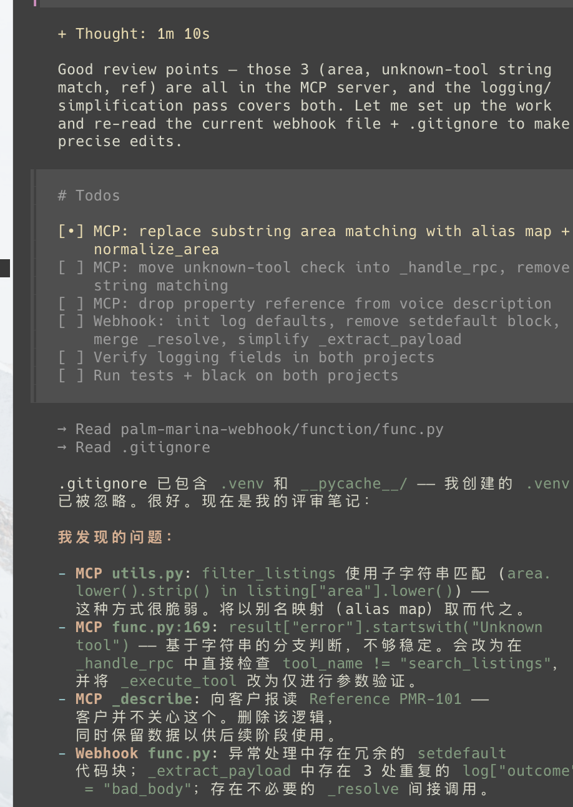
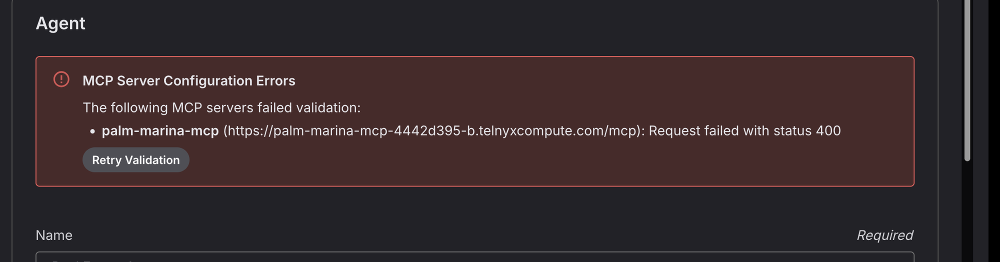

# Thought Process and Issues

This file documents the blockers I ran into while working through the challenge, and how I solved each one.
I wrote it myself (AI was used only for formatting and phrasing) to give you a real view of my thought process.

## 1. Setup

Following the OpenCode installation command from the website installed the latest version (2.0.23):

```bash
bun install -g --trust @opencode/cli
```

This works fine on its own. The problem appears when adding the Telnyx plugin on version 2.0.23 or above:

```bash
opencode plugin @telnyx/opencode
```

This returned:

```
Unknown subcommand "@telnyx/opencode" for "opencode plugin"
```

Running:

```bash
opencode plugin list
```

showed the Telnyx plugin, but with no version or ID.

At this point I already suspected a version mismatch. I checked with AI to verify, and that turned out to be correct.

To validate it, I compared the installed OpenCode version with the plugin's dependency on npm. The plugin's `package.json` clearly refers to `"@opencode-ai/plugin": "^1.2.27"`, which works for versions below 2.0.0. Since I was on 2.0.23, it didn't work.

I then removed that OpenCode version and installed this one instead:

```bash
bun install -g --trust opencode-ai@1.18.34
```

After that, I ran the commands from the gist to log in with my Telnyx key and run an open-weight model.

## 2. Building

I bounced a lot of ideas off the agent, and it quickly got overwhelming. It made the most sense to split the work into phases and start from the absolute basics:

1. Setting up the assistant's instructions and the conversation workflow, with its LLM configuration, entirely in the Telnyx portal, with zero code deployed.
2. A very simple MCP server that returns listings.

This is the first version of the workflow:


From there, each new commit expands the solution, and `PLAN.md` gets updated along the way. This structure helps me organize my thoughts and test everything step by step, and it lets you follow my process as if it were happening in real time.

## 3. Use of agents

I started out working with Kimi K2.6, first brainstorming with it and then building alongside it. I noticed some bad calls:

- recommending a webhook instead of an MCP server that could hold several tools
- the wrong folder structure and naming conventions
- lower code quality overall

Looking back, this makes sense. We had been brainstorming and bouncing ideas for quite a while in the same session, and by the time the actual building started, the model began hallucinating and losing track of the main points. That was the right moment to move to a new agent and a fresh session.

Starting a new agent meant explaining everything again. That's when it made sense to create two files: `CHALLENGE.md`, with the actual requirements of the task copied in, and `PLAN.md`, a v1 of the plan that suits me.

## 4. Package-relative imports (Stage 2)

The first version of `function/func.py` did `from utils import ...` and `function/utils.py`
did `from listings import ...`. Both worked when I ran them as plain scripts from inside
`function/`, and the local ad-hoc checks all passed — so it looked fine.

It wasn't. Telnyx's Edge runtime (and the official Python examples) import `function` as a
package: `from function import new`, with `function/__init__.py` re-exporting `new`. Under
that import style `utils` isn't a top-level module — it's `function.utils` — so the
absolute import raises `ModuleNotFoundError: No module named 'utils'` at deploy time.

Two things hid the bug:

1. My local smoke test did `sys.path.insert(0, 'function')` and imported the modules as
   top-level. That's a different import style than the runtime uses, so it passed.
2. `function/__init__.py` was empty, so `from function import new` also failed — but I
   had never tried that form, only `from function.func import new`.

The fix was small: make the three sibling imports package-relative
(`from .utils import ...`, `from .listings import ...`) and set
`function/__init__.py` to `from .func import new`. The bug was caught by testing
the import both ways — as a top-level module and as a package (`from function import
new`) — _before_ deploying. That test now lives in `tests/conftest.py`'s `caller` fixture,
which imports via `from function import new`, so the suite fails fast under the wrong
import style.

Lesson: match the runtime's import style in the test harness, not just the script
style that's convenient locally.

## 5. Misleading error when credits ran out

While sending a new task to the agent, OpenCode returned this error:

```
Forbidden: {
  "errors": [
    {
      "code": "20015",
      "title": "Feature not enabled",
      "detail": "User account is not enabled for inference.",
      "meta": { "url": "https://developers.telnyx.com/docs/overview/errors/20015" }
    }
  ]
}
```

The error points to account permissions, so I checked that first. OpenCode was still logged in with my Telnyx key,
and the same setup was working the day before, so the key and the plugin were fine.

The real cause was in the portal notifications. I had run out of credits:


So a billing problem was returned as "Feature not enabled". A clear error like "insufficient balance" would have
pointed me to the right place straight away. The alert itself is also a bit odd: a balance of `$-0.00` is shown as
below a threshold of `$0.00`.

## 6. The MCP example was not a real MCP server

For the MCP server, the agent used Telnyx's
[edge-mcp-server-deploy-python](https://github.com/team-telnyx/telnyx-code-examples/tree/main/edge-mcp-server-deploy-python)
example as a reference. That example exposes the tools as plain REST endpoints (`/mcp/tools/list` and
`/mcp/tools/call`), and it only works with its own demo client.


The logging I had added just before made this easy to find. The logs showed the portal sending `POST /` and getting
a 404 each time I clicked Save:

```
[2026-10-05T21:33:31.333Z] {"method": "POST", "path": "/", "outcome": "not_found", "status": 404, ...}
[2026-10-05T21:33:37.903Z] {"method": "POST", "path": "/", "outcome": "not_found", "status": 404, ...}
[2026-10-05T21:34:00.414Z] {"method": "POST", "path": "/", "outcome": "not_found", "status": 404, ...}
```

The platform's own request logs (`telnyx-edge logs --type invocations`) showed the same three 404s. The full logs
are saved in `docs/evidence/`.

A real MCP client doesn't call a separate URL for each action. It sends JSON-RPC messages to one endpoint, and the
action is inside the body. It starts with a handshake: `initialize`, then `notifications/initialized`, then
`tools/list`. Our server had no JSON-RPC wrapping and no initialize handling, so the portal failed at the very
first step.

The fix was to rewrite the server as a proper MCP server on `POST /mcp`: handle `initialize`, notifications,
`tools/list` and `tools/call`, and return standard JSON-RPC errors. The tool now also returns a short spoken
summary instead of raw JSON.

## 7. MCP security

After testing, the MCP server was working well: it fetched the right listings and was very fast. I also adjusted the
node prompts to improve the conversation flow.

I knew the MCP server could be called by anyone who found its URL, so I added security once testing was done. After
reading the Telnyx Edge docs, the solution was straightforward and there was no need to over-engineer it:

1. Generate a random token locally.
2. Store it as an Edge secret (`telnyx-edge secrets add MCP_TOKEN ...`). The function reads it from the environment
   with `os.environ["MCP_TOKEN"]`, so it never appears in the code.
3. Store the same token in the Telnyx portal as the MCP server's API key. Telnyx sends it with every request to the
   MCP server.
4. The server compares the two and rejects any request without the right token.

The commands I ran:

```bash
# Generate a random token straight into the clipboard, without printing it
python3 -c "import secrets; print(secrets.token_urlsafe(32), end='')" | pbcopy

# Store it as an Edge secret, injected into the function as the MCP_TOKEN environment variable
telnyx-edge secrets add MCP_TOKEN "$(pbpaste)"

# Clear the clipboard once the token is also saved in the Telnyx portal
echo -n | pbcopy
```

In the portal, I saved the same token as an integration secret and selected it in the MCP server's API Key field.

This blocks any unknown source from calling the MCP server.

I didn't see a need for full OAuth with a sign-in flow. That is useful when different users each connect their own
accounts. In our case it is just one server talking to another.

## 8. Reviewing the agent's changes

I review every change the agent makes before shipping it. A few points from this round:

1. **Matching area names.** I was worried about how the search matches area names. I didn't want hardcoded values,
   because a caller might say "JBR" and mean Jumeirah Beach Residence. The model first suggested a map of synonyms,
   but that would be hard to maintain and keep track of. Instead, we build the list of areas from the data we have
   and let the model decide which area the caller means. It should be smart enough to do this, and I will confirm it
   by testing after shipping.

2. **Webhook cleanup.** The Stage 3 webhook had duplicated code (the same log line set three times, and an unneeded
   helper). I asked for it to be simplified, and checked that each log line only has the fields we need. The logs
   are now easy to read and debug. For example, a real call in the MCP server's logs
   (`telnyx-edge logs palm-marina-mcp`):

   ```
   [2026-10-06T09:21:16.876Z] {"rpc_method": "tools/call", "tool": "search_listings",
     "arguments": {"area": "Dubai Marina", "bedrooms": 2}, "outcome": "ok", "count": 1}
   ```

3. **GLM 5.2 switched to Chinese** halfway through one of its answers, in the middle of a code review, for no clear
   reason. It wasn't a big deal, but it was interesting to note down.

   

## 9. Debugging the MCP token failure

After adding the token check, the portal could no longer connect to the MCP server:



The portal showed different status codes on different tries (503, then 400), but my own logs showed what really
happened: every request from Telnyx was rejected with a 401. The platform's invocation logs
(`telnyx-edge logs palm-marina-mcp --type invocations`) confirmed the same 401s.

The problem was that my log line only said this:

```
{"outcome": "unauthorized"}
```

That told me the token check failed, but not why. I assumed I had copied the wrong key into the portal, since I had
generated the token twice, but the logs couldn't prove it.

So I updated the log line to include the reason for the failure, without ever logging the token itself. The next
attempt showed:

```
{"outcome": "unauthorized", "auth_failure": "no authorization header",
 "header_names": ["accept", "content-type", "traceparent", "user-agent", "x-request-id", ...]}
```

So my guess was wrong: it wasn't the wrong token, Telnyx wasn't sending a token at all. While setting up the key I
had ended up with two MCP servers with the same name, and the assistant was still using the one without the API key.
I couldn't find a way to fully delete an MCP server in the portal, so I switched the assistant to the server that has
the key. The next validation went straight through:

```
{"rpc_method": "initialize", "outcome": "ok"}
{"rpc_method": "notifications/initialized", "outcome": "accepted"}
{"rpc_method": "tools/list", "outcome": "ok"}
```

Without the reason in the log I would have kept regenerating tokens for nothing. Adding this kind of detail to log
lines from the start is something I'll do next time.

## 10. Moving the MCP server to TypeScript

For the viewings I needed a Stateful Actor, but actors only work with TypeScript, and my MCP server was in Python.

I could have still used Python and called a small TypeScript actor over HTTP, but that adds an extra request
(more latency) and another public URL that I would need to protect with a second token.

I did more research into Edge Compute with TypeScript and saw the power of everything being injected at runtime.
The actor, KV and the storage bucket are just there in `env` (`env.CALENDAR`, `env.CACHE`, `env.FILES`), and Telnyx
handles the credentials. So I decided to shift to one centralized MCP server in TypeScript. This also sounded more
interesting to play around with. The old Python version is still in the git history. The dynamic variables webhook
stayed in Python at first because it didn't need any of this, and later moved to TypeScript too, so it reads KV
through the `env` binding instead of the REST API.

I also wanted to discover Telnyx Cloud Storage, so I used it to mimic a production database. Our `listings.json`
lives in a bucket, like an export from the brokerage's CRM. The MCP server fetches it from there and keeps a copy
in KV for one hour, so most searches don't touch the bucket.

Why actors for the bookings: the problem is double booking. If two callers ask for Layla's Saturday 4pm viewing at
the same moment, a normal function could check "is it free?" for both, get yes twice, and book the same slot two
times. KV wouldn't fix it either, because it has no locks and the last write just wins.

An actor solves this because it is single threaded. Each agent has their own calendar actor (one for Layla, one for
Omar, one for Sara) that holds their bookings, and each one handles one call at a time. So the two bookings for Layla
run one after the other: the first one books the slot, and the second one sees it's already taken and gets offered
the next free times. I don't need any locks for this, the platform does it for me. And because every agent has their
own calendar actor, a booking with Omar never has to wait behind a booking with Layla.

Next plan would be maybe sending brochures to clients, like PDFs through WhatsApp or email. I still need to look
into that.

## 11. The workflow never left the first node

The bookings were working, but I noticed every call stayed in "Identify Intent" from start to finish. Because the
other nodes never ran, their rules didn't either. The assistant booked without reading the details back, read the
booking id out loud, got the date wrong for "in two days", and never reached the Goodbye node or hung up.

First I turned on "Override assistant tools" for Identify Intent and only allowed Hang Up. It didn't help, the logs
still showed `search_listings` being called while the transcript said Identify Intent. So this setting doesn't apply
to MCP tools, they are attached to the whole assistant.

Then I wanted to make sure my setup wasn't wrong, so I read the saved assistant through the API. All the edges were
saved correctly, so the config was fine.

Reading the docs more closely explained it. On a call, moving to another node is also a tool call
(`transition__...`), and it only happens if the model chooses it. The model always picked the tool that answers the
caller instead.

I also tried a different model only on that node. GLM-5.3 is a reasoning model, and on the call it started speaking
its thinking out loud to the caller, so I reverted it straight away. Not every model works for voice.

What actually fixed it was the wording. Once each node said to "call the transition tool" when it's done, the call
moved from Identify Intent to Buying Flow for the first time.

After that I used the conversation API to see the real path of each call, since every message has a
`flow_node_id`. This showed the next problems: the booking still happened inside the search node, and the call got
stuck at the end because the booking node had no way to say goodbye and no hangup tool.

So I simplified the workflow:

- Buying and Property Inquiry were almost the same, so I merged them into one "Find a Property" node.
- I removed the "Anything Else" node. Each node now asks "anything else?" and goes straight to the next step or to
  Goodbye.
- Returning callers go to a "Welcome Back" node using a variable comparison on `is_returning_caller`, so the webhook
  data decides the route, not the LLM.
- Hang Up is allowed on every node, just in case a transition is missed.

## 12. Cancelling a viewing, and why the calendar is per agent

At first a booking gave back an id like `BK-x7f2`, and you needed it to cancel. Nobody remembers that on a phone
call, so I changed it: a viewing is booked under the caller's name, and to cancel you only give the name and the day.

Then I noticed the cancel goes through every agent. It asks Layla's calendar actor "do you have Omar on the 8th?", then
Omar's, then Sara's, until one says yes. This is because the cancel only knows who and when, not which agent, and
each agent has their own calendar.

So I asked myself, wouldn't it make more sense to just store bookings, with the agent's name on each one? It turns
out the key decides two things: what you can find quickly, and what is protected from two calls at the same time.

- Keyed by agent (what we have): double booking is impossible, because Sara's calendar handles one call at a time,
  and her free times are one call away. But cancelling has to check every agent.
- Keyed by booking or by caller: cancelling is one call. But if Omar and James both book Sara at 4pm at the same
  moment, they write two different keys, both succeed, and Sara has two people at 4pm. And to show her free times
  you have to look through every booking.

So whichever key you pick, one direction is fast and the other turns into a search. Keeping a second copy, like a
per-caller index, fixes the search but then you have two copies to keep in sync.

With 3 agents the cancel is at most 3 small actor calls, so I kept the calendar per agent. It's exactly what actors
are for, one owner per agent and one call at a time. At a real brokerage with hundreds of agents I would move
bookings to a database table instead: one row per booking with the agent on it, a unique constraint on agent and
slot so the database itself refuses a double booking, and an index on the caller's number so cancelling is one
query. That is my "booking with the agent's name" idea, done with the right tool.

## 13. Testing the calls and debugging

Most of these came from calling the number myself and then reading three things side by side: the transcript in the
portal (what was said and when), our JSON log lines (`telnyx-edge logs palm-marina-mcp`), and the platform's
invocation log (`--type invocations`), which gives how long every request took.

**Cancelling stayed in the first node and got the date wrong.** I asked to cancel a viewing for "tomorrow". The
transcript showed every line in Identify Intent, and the tool call had `"caller_name": "Unknown"` and
`"date": "2026-10-11"`, when tomorrow was the 8th. Identify Intent runs in replace mode, so it doesn't get the base
instructions, including the one with today's date. The model was cancelling in a step that didn't know what day it
was. I made Identify Intent hand cancels over to Cancel A Viewing, and changed the date to use Telnyx's own variables:
`{{telnyx_current_time_Asia/Dubai}}`, instead of giving it UTC and asking it to add 4 hours. Then I noticed a time zone
edge case: I'm in Lebanon, one hour behind Dubai, so between 11pm and midnight my "tomorrow" is a different day than
Dubai's. So before cancelling, the assistant now says the real date back ("That's Thursday 8 October?").

**Saving a seller's lead made the caller wait 45 seconds.** George kept saying "let me check that for you" and the
portal showed `tool_timeout` three times. Our log said exactly why: `KV put("lead/<my-sip-address>@sip.telnyx.eu") failed:
HTTP 400 ... Allowed characters: a-z A-Z 0-9 - _ / = .` KV keys can't contain `@`, and not `+` either, so every lead
saved under a phone number would have failed, not just my test calls (they come from a SIP address). The tests didn't
catch it because the fake KV accepted any key. The waiting came from a second problem: the crash went back as an HTTP
500, which Telnyx treats as no answer, so it waited its 15 second tool timeout and tried again. I fixed the key, made
the fake KV reject bad keys like the real one, and made a crash come back as a normal tool error straight away. I also
lowered the MCP server's tool timeout to 8 seconds, gave both assistants the transfer tool, and told them to stop
retrying after a failure and offer a real agent instead.

**Silence while booking.** After I confirmed a booking I heard nothing for about 5 seconds and said "Hello?". The
timestamps showed where it went: about 3 seconds of Telnyx reconnecting to our server, about 1 second for the tool,
and about 3 seconds of the model writing its answer. Each request that reads the listings from KV takes about 1
second, while one that doesn't takes 7 ms, so the KV read is our part. I thought about keeping the listings in memory
to skip it, but I'd rather keep it simple, KV already is the cache. The filler messages only play while a tool is
running, and each wait was shorter than the filler's delay, so none of them played. "Let me check that for you" also
sounded wrong when George was saving details, not checking anything. So both assistants now say "One moment, please."
the moment a tool starts, and "Still checking." if it takes more than 3 seconds.

**George asked before explaining.** He asked "can I text you the link?" and only explained the listing agreement
after I said yes, so I asked "what is it exactly?". The question was at the end of Seller Details and the explanation
was the speak node after it. Now George saves the details, the speak node explains what Form A is, and only then does
he ask "shall I text you the link?".

**"Buy" heard as "bye".** I said "let's say buy" and speech to text heard "bye", so the assistant said its goodbye line
in the middle of a search. I added a rule: if the caller says "bye" while still giving details, treat it as "buy", and
ask if it isn't clear.
