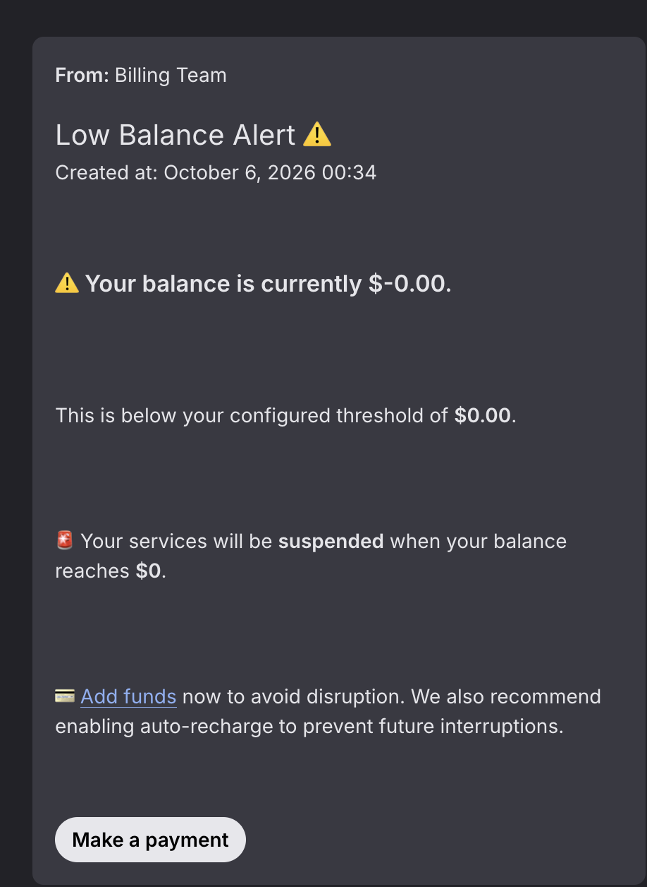
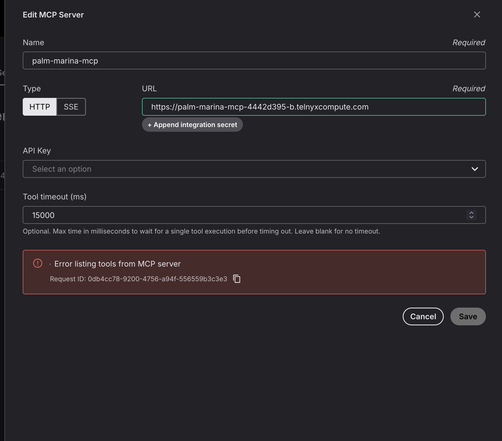

# Thought Process and Issues

This file documents the blockers I ran into while working through the challenge, and how I solved each one.
I wrote it myself (AI was used only for formatting and phrasing) to give you a real view of my thought process.

## 1. Setup

Following the OpenCode installation command from the website installed the latest version (2.0.23):

```bash
bun install -g --trust @opencode/cli
```

This works fine on its own. The problem appears when adding the Telnyx plugin on version 2.0.23 or above:

```bash
opencode plugin @telnyx/opencode
```

This returned:

```
Unknown subcommand "@telnyx/opencode" for "opencode plugin"
```

Running:

```bash
opencode plugin list
```

showed the Telnyx plugin, but with no version or ID.

At this point I already suspected a version mismatch. I checked with AI to verify, and that turned out to be correct.

To validate it, I compared the installed OpenCode version with the plugin's dependency on npm. The plugin's `package.json` clearly refers to `"@opencode-ai/plugin": "^1.2.27"`, which works for versions below 2.0.0. Since I was on 2.0.23, it didn't work.

I then removed that OpenCode version and installed this one instead:

```bash
bun install -g --trust opencode-ai@1.18.34
```

After that, I ran the commands from the gist to log in with my Telnyx key and run an open-weight model.

## 2. Building

I bounced a lot of ideas off the agent, and it quickly got overwhelming. It made the most sense to split the work into phases and start from the absolute basics:

1. Setting up the assistant's instructions and the conversation workflow, with its LLM configuration, entirely in the Telnyx portal, with zero code deployed.
2. A very simple MCP server that returns listings.

This is the first version of the workflow:


From there, each new commit expands the solution, and `PLAN.md` gets updated along the way. This structure helps me organize my thoughts and test everything step by step, and it lets you follow my process as if it were happening in real time.

## 3. Use of agents

I started out working with Kimi K2.6, first brainstorming with it and then building alongside it. I noticed some bad calls:

- recommending a webhook instead of an MCP server that could hold several tools
- the wrong folder structure and naming conventions
- lower code quality overall

Looking back, this makes sense. We had been brainstorming and bouncing ideas for quite a while in the same session, and by the time the actual building started, the model began hallucinating and losing track of the main points. That was the right moment to move to a new agent and a fresh session.

Starting a new agent meant explaining everything again. That's when it made sense to create two files: `CHALLENGE.md`, with the actual requirements of the task copied in, and `PLAN.md`, a v1 of the plan that suits me.

## 4. Package-relative imports (Stage 2)

The first version of `function/func.py` did `from utils import ...` and `function/utils.py`
did `from listings import ...`. Both worked when I ran them as plain scripts from inside
`function/`, and the local ad-hoc checks all passed — so it looked fine.

It wasn't. Telnyx's Edge runtime (and the official Python examples) import `function` as a
package: `from function import new`, with `function/__init__.py` re-exporting `new`. Under
that import style `utils` isn't a top-level module — it's `function.utils` — so the
absolute import raises `ModuleNotFoundError: No module named 'utils'` at deploy time.

Two things hid the bug:

1. My local smoke test did `sys.path.insert(0, 'function')` and imported the modules as
   top-level. That's a different import style than the runtime uses, so it passed.
2. `function/__init__.py` was empty, so `from function import new` also failed — but I
   had never tried that form, only `from function.func import new`.

The fix was small: make the three sibling imports package-relative
(`from .utils import ...`, `from .listings import ...`) and set
`function/__init__.py` to `from .func import new`. The bug was caught by testing
the import both ways — as a top-level module and as a package (`from function import
new`) — *before* deploying. That test now lives in `tests/conftest.py`'s `caller` fixture,
which imports via `from function import new`, so the suite fails fast under the wrong
import style.

Lesson: match the runtime's import style in the test harness, not just the script
style that's convenient locally.

## 5. Misleading error when credits ran out

While sending a new task to the agent, OpenCode returned this error:

```
Forbidden: {
  "errors": [
    {
      "code": "20015",
      "title": "Feature not enabled",
      "detail": "User account is not enabled for inference.",
      "meta": { "url": "https://developers.telnyx.com/docs/overview/errors/20015" }
    }
  ]
}
```

The error points to account permissions, so I checked that first. OpenCode was still logged in with my Telnyx key,
and the same setup was working the day before, so the key and the plugin were fine.

The real cause was in the portal notifications. I had run out of credits:



So a billing problem was returned as "Feature not enabled". A clear error like "insufficient balance" would have
pointed me to the right place straight away. The alert itself is also a bit odd: a balance of `$-0.00` is shown as
below a threshold of `$0.00`.

## 6. The MCP example was not a real MCP server

For the MCP server, the agent used Telnyx's
[edge-mcp-server-deploy-python](https://github.com/team-telnyx/telnyx-code-examples/tree/main/edge-mcp-server-deploy-python)
example as a reference. That example exposes the tools as plain REST endpoints (`/mcp/tools/list` and
`/mcp/tools/call`), and it only works with its own demo client.



The logging I had added just before made this easy to find. The logs showed the portal sending `POST /` and getting
a 404 each time I clicked Save:

```
[2026-10-05T21:33:31.333Z] {"method": "POST", "path": "/", "outcome": "not_found", "status": 404, ...}
[2026-10-05T21:33:37.903Z] {"method": "POST", "path": "/", "outcome": "not_found", "status": 404, ...}
[2026-10-05T21:34:00.414Z] {"method": "POST", "path": "/", "outcome": "not_found", "status": 404, ...}
```

The platform's own request logs (`telnyx-edge logs --type invocations`) showed the same three 404s. The full logs
are saved in `docs/evidence/`.

A real MCP client doesn't call a separate URL for each action. It sends JSON-RPC messages to one endpoint, and the
action is inside the body. It starts with a handshake: `initialize`, then `notifications/initialized`, then
`tools/list`. Our server had no JSON-RPC wrapping and no initialize handling, so the portal failed at the very
first step.

The fix was to rewrite the server as a proper MCP server on `POST /mcp`: handle `initialize`, notifications,
`tools/list` and `tools/call`, and return standard JSON-RPC errors. The tool now also returns a short spoken
summary instead of raw JSON.
