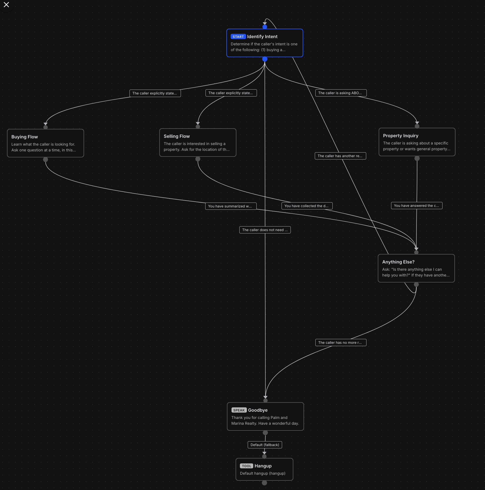

# Thought Process and Issues

This file documents the blockers I ran into while working through the challenge, and how I solved each one.
I wrote it myself (AI was used only for formatting and phrasing) to give you a real view of my thought process.

## 1. Setup

Following the OpenCode installation command from the website installed the latest version (2.0.23):

```bash
bun install -g --trust @opencode/cli
```

This works fine on its own. The problem appears when adding the Telnyx plugin on version 2.0.23 or above:

```bash
opencode plugin @telnyx/opencode
```

This returned:

```
Unknown subcommand "@telnyx/opencode" for "opencode plugin"
```

Running:

```bash
opencode plugin list
```

showed the Telnyx plugin, but with no version or ID.

At this point I already suspected a version mismatch. I checked with AI to verify, and that turned out to be correct.

To validate it, I compared the installed OpenCode version with the plugin's dependency on npm. The plugin's `package.json` clearly refers to `"@opencode-ai/plugin": "^1.2.27"`, which works for versions below 2.0.0. Since I was on 2.0.23, it didn't work.

I then removed that OpenCode version and installed this one instead:

```bash
bun install -g --trust opencode-ai@1.18.34
```

After that, I ran the commands from the gist to log in with my Telnyx key and run an open-weight model.

## 2. Building

I bounced a lot of ideas off the agent, and it quickly got overwhelming. It made the most sense to split the work into phases and start from the absolute basics:

1. Setting up the assistant's instructions and the conversation workflow, with its LLM configuration, entirely in the Telnyx portal, with zero code deployed.
2. A very simple MCP server that returns listings.

This is the first version of the workflow:



From there, each new commit expands the solution, and `PLAN.md` gets updated along the way. This structure helps me organize my thoughts and test everything step by step, and it lets you follow my process as if it were happening in real time.

## 3. Use of agents

I started out working with Kimi K2.6, first brainstorming with it and then building alongside it. I noticed some bad calls:

- recommending a webhook instead of an MCP server that could hold several tools
- the wrong folder structure and naming conventions
- lower code quality overall

Looking back, this makes sense. We had been brainstorming and bouncing ideas for quite a while in the same session, and by the time the actual building started, the model began hallucinating and losing track of the main points. That was the right moment to move to a new agent and a fresh session.

Starting a new agent meant explaining everything again. That's when it made sense to create two files: `CHALLENGE.md`, with the actual requirements of the task copied in, and `PLAN.md`, a v1 of the plan that suits me.
